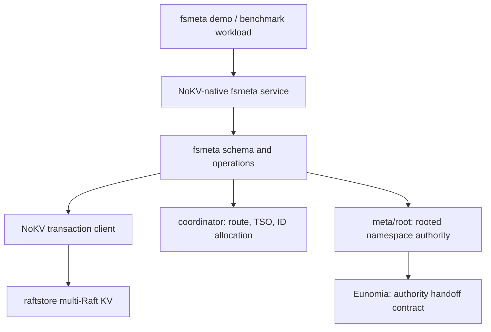

# 2026-04-24 fsmeta 定位：面向分布式文件系统的元数据底座

> 状态：current public positioning v5。`fsmeta/` 已落 schema、plan、executor、cross-region 2PC consumption、native gRPC service + typed client、`ReadDirPlus`、`WatchSubtree`、`SnapshotSubtree`、`RenameSubtree`、`Link` / `Unlink` link-count lifecycle、mount lifecycle、quota fence + persisted usage counter，以及 native-vs-generic benchmark（同集群 ReadDirPlus 42.5×）。
>
> v5 相对 v4 的主要修订：
>
> - 把 Stage 2/3 已实现的 primitive 从 roadmap 口吻改成 current implementation；
> - 明确 quota fence 是 rooted truth，usage counter 是 data-plane key，不写进 `meta/root`；
> - 明确 `nokv-fsmeta` lifecycle monitor 启动时 bootstrap，之后跟随 `WatchRootEvents`，`MonitorInterval` 是 reconnect backoff；
> - `Link` / `Unlink` link-count lifecycle 已实现，目录 hard link 仍非法；
> - `DeleteSubtree`、FUSE frontend、S3 HTTP/object body I/O、snapshot GC retention enforcement 仍是非目标 / future work。
>
> v4 相对 v3 的主要修订：
>
> - **定位扩展**：fsmeta 不只服务于分布式文件系统，**同时服务于对象存储 namespace 层**——schema 从一开始就没硬编码 POSIX 假设，FS 和 object storage 共用同一份 substrate；
> - 新增 §1.5 三类消费者并列定位（DFS / Object storage / AI dataset），三种身份共享同一份架构；
> - §7 Stage 2 primitive 增列对象存储侧的应用（`RenameSubtree` 解决 S3 没有原生 prefix rename 的痛点等）；
> - §8 工业生态位中"对象存储网关 namespace 层"从 adjacent niche 提到与 DFS 并列的主要消费者；
> - 确认 `meta/root` 的 namespace authority 扩展（mount registry / snapshot epoch / subtree authority / quota fence / namespace tombstone）**对 FS 和 object storage 完全通用**，schema 不为特定消费者特化。
>
> v3 修订（保留）：新增 §7.5 主流分布式 KV primitive 能力对比矩阵；新增 §7.6 三类结构性优势分类（Shape / Structure / Correctness）；§10 Related Work 扩充为分级研究热点 + Stage 2 primitive × 研究锚点映射；Stage 1 benchmark 锚点确认。
>
> v2 修订（保留）：Stage 1 从 JuiceFS TKV adapter 改为 NoKV-native metadata service；JuiceFS 降级为 Stage 3 兼容性验证。

## 导读

- 🧭 主题：NoKV 作为云原生分布式文件系统的 metadata service，是否是一个成立的生态位。
- 🧱 核心对象：`fsmeta`、`raftstore`、`percolator`、`coordinator`、`meta/root`、Eunomia。
- 🔁 调用链：native fsmeta service -> `fsmeta` schema/API -> NoKV transaction client -> raftstore multi-Raft execution；mount/subtree authority -> `meta/root` rooted events。
- 📚 参考对象：
  - 工业 —— Meta Tectonic、Google Colossus、DeepSeek 3FS、CephFS、HDFS/RBF、JuiceFS、CurveFS、CubeFS、Lustre、FoundationDB、etcd；
  - 学术 —— Weil'04、IndexFS、ShardFS、HopsFS、InfiniFS、CFS、Tectonic、λFS、FileScale、FoundationDB、DaisyNFS、Mooncake、Quiver。

## 1. 结论

NoKV 不应该把这个方向包装成"又一个分布式文件系统"，也不应该窄化为"只服务 DFS 元数据"。更准确的位置是：

> **NoKV fsmeta 是 hyperscaler "stateless schema 层 + 外部事务 KV" 架构在 Go + CNCF 生态里的开源实现，作为 namespace metadata substrate 同时服务于分布式文件系统、对象存储 namespace 层、AI dataset 元数据三类消费者。**

**为什么这个定位站得住**：2021 年以来，hyperscaler 的 namespace metadata 设计已经**明显收敛**到同一个模式——Google Colossus (Curator + Bigtable)、Meta Tectonic (ZippyDB)、DeepSeek 3FS (FoundationDB)、Snowflake (FoundationDB)——都是"无状态 schema / 业务层 + 外部事务 KV 做持久层"。这条 pattern 不分文件系统还是对象存储；Tectonic 在 Meta 内部既支撑 FS 又支撑 warehouse，Colossus 在 Google 内部从 BigQuery 到 GCS 多种产品共用。

开源 / CNCF 生态有 CubeFS、Curve、JuiceFS 这类完整 DFS frontend，也有 MinIO 这类 no-metadata-service 对象存储——但**缺一个 namespace metadata workload 调过边界的开源事务 KV substrate**：既能给 DFS 提供 inode/dentry/subtree 语义，又能给对象存储网关提供 bucket/prefix/version 的 namespace authority，**两类消费者共用同一份底座**。

这个生态位和现有系统不完全重叠：

- JuiceFS 把 metadata engine 抽象成可插拔接口，但它自己不做 KV；TKV 模式下 inode/dentry/chunk/session 都编码成普通 key/value。
- 3FS 的 metadata service 轻量，所有事务边界都压到 FoundationDB；inode 用 `INOD`、dentry 用 `DENT`。
- Meta Tectonic 把 metadata 拆成 Name / File / Block 三层，全部压到 ZippyDB。
- CurveFS / CephFS 是完整文件系统，metadata service 深度绑定自己的客户端协议。
- MinIO 显式不要 metadata service（per-object xl.meta + erasure set），代价是没有原生 atomic prefix rename、LIST 性能受 fan-out 限制。
- S3 / GCS / ADLS 是闭源的，且 S3 直到 2020 才达到 strong consistency，prefix rename 至今没有原生支持。
- etcd 是小规模强一致配置 KV，不适合承接数亿 inode/object 主存储。

NoKV 要做的不是"比它们都强"，而是做一个**专门给 namespace metadata workload 调过边界的、开源可运维的 KV/transaction substrate**：目录 / 前缀 range、inode/dentry lifecycle、subtree authority、readdir+stat / list+head 融合、watch/cache invalidation 这些语义下沉到存储层，而不是全靠上层应用拼出来。

## 1.5 三类消费者并列定位

fsmeta 的同一份架构对外有**三种身份**，pitch 时选其一，不混讲：

| 消费者 | 身份描述 | 对标 / 替代 |
|---|---|---|
| **DFS frontend**（FUSE / native client） | open-source Go-native CNCF metadata kernel for distributed filesystems | CubeFS MetaNode / CurveFS Metaserver / HopsFS / 3FS metadata |
| **Object storage namespace 层**（S3-compatible gateway / MinIO 替代 / ADLS-style hierarchical-over-flat） | namespace authority layer object storage gateways have always wanted; 提供 atomic prefix rename / 一致 LIST / bucket-level snapshot | MinIO（无 metadata service）/ ADLS Gen2（闭源）/ S3 + 应用层一致性 hack |
| **AI dataset / 数据湖 service** | metadata substrate for AI workloads with checkpoint storm + dataset versioning + subtree watch | Mooncake KVCache pattern / 3FS dataset layer / Alluxio decentralized metadata |

**三种身份共用同一份架构**：schema 不分 fs/object，`meta/root` namespace authority 事件不分 fs/object，fsmeta primitive 对三类消费者**全部有效**。这是 hyperscaler "一个 substrate, 多个市场"的标准打法。

**关键纪律**：MountRegistered 等 rooted event 的 config 字段保持**通用 `map[string]bytes`**，让消费者（FUSE frontend / S3 gateway / dataset service）自己解释——`meta/root` rooted truth 不为某一类消费者特化。

## 2. 外部系统事实核验

### 2.1 工业系统

| 系统 | 元数据落点 | 工程含义 | 对 NoKV 的启发 |
|---|---|---|---|
| **Meta Tectonic** (FAST'21) | 三层 metadata（Name / File / Block），全部压到 ZippyDB（Paxos-replicated RocksDB KV）。stateless front-end。按 directory-id / file-id / block-id hash partition。参考：[FAST'21 PDF](https://www.usenix.org/system/files/fast21-pan.pdf)。 | 论文 §3.2 自己承认：MapReduce 读同目录 10k 个文件 → 单 ZippyDB shard 融化。hash-by-dir 解决不了 fan-in hotspot。 | NoKV 的 range-partitioned multi-Raft + split-on-hotness 是这条痛点的直接答案。 |
| **Google Colossus** | stateless Curators + Bigtable 存 FS 行；根元数据靠 Chubby 协调。参考：[Google Cloud blog](https://cloud.google.com/blog/products/storage-data-transfer/a-peek-behind-colossus-googles-file-system)。 | Curator 不服务数据，只做 control plane。scale 靠 Bigtable tablet split。 | 验证"stateless meta + external tx-KV"是成熟范式，不是异端。 |
| **DeepSeek 3FS** | stateless meta service + FDB；inode `"INOD"+le64(id)`、dentry 按 parent inode 聚簇。SSI 事务。参考：[3FS design notes](https://github.com/deepseek-ai/3FS/blob/main/docs/design_notes.md)。 | 继承 FDB 硬限（10MB / 5s / 10KB key）；文件长度在并发写入时只做最终一致，`close/fsync` 修正。 | 不照抄 FDB layer：把 metadata 常见原语下沉到 KV 层，绕开 5s 单事务上限的妥协。 |
| **JuiceFS + TiKV** | TKV 模式下 inode / dentry / chunk / session 编码成普通 KV。参考：[JuiceFS Internals](https://juicefs.com/docs/community/internals/)。 | JuiceFS 不要求 metadata backend 理解目录；TiKV 只是通用 range KV + tx。 | 它是反面边界：TKV 兼容会隐藏 fsmeta 的 native 差异化。NoKV 可以 Stage 3 验证兼容性，但 Stage 1 不以它为主线。 |
| **CubeFS MetaNode** | meta-partition 按 inode range，multi-Raft；内存 B-tree + snapshot + WAL。参考：[CubeFS design](https://www.cubefs.io/docs/master/design/metanode.html)。 | inode range 不天然等价于 parent-directory locality，大目录和跨目录操作仍要在文件系统层处理。 | NoKV 可以优先探索目录前缀 / subtree-aware 的 range placement，让 locality 成为存储层合同的一部分。 |
| **CurveFS** | MDS 用 etcd 存拓扑（HA）；Metaserver 存 inode/dentry（multi-Raft）。参考：[CurveFS architecture](https://docs.opencurve.io/CurveFS/architecture/architecture-intro)。 | CurveFS 明确不把 etcd 当 inode/dentry 主存储。 | 支持我们的判断：etcd 不适合承接高 churn FS metadata。 |
| **CephFS MDS** | stateful MDS + RADOS；Weil 2004 "dynamic subtree partitioning"。参考：[Weil SC'04](https://ceph.io/assets/pdfs/weil-mds-sc04.pdf)、[tracker #24840](https://tracker.ceph.com/issues/24840)。 | subtree balancer 不稳定（18 小时 delayed request），Reef+ 默认关闭多 MDS balancing。2025 年 [ACM TOS](https://dl.acm.org/doi/10.1145/3721483) 仍在研究怎么修。 | 20 年未修的包袱是我们的攻击面：NoKV 用 Eunomia 把 subtree handoff 形式化，规避 Ceph balancer 不稳定性。 |
| **HDFS + RBF** | 单 JVM NN + QJM；federation 静态切；RBF router stateless。参考：[HDFS RBF](https://hadoop.apache.org/docs/stable/hadoop-project-dist/hadoop-hdfs-rbf/HDFSRouterFederation.html)。 | LinkedIn 1.1B objects / 380GB heap；Uber 切 ViewFs；跨 subcluster rename 不支持。 | 静态 federation 的硬限定义了对比基线。 |
| **FoundationDB** | 单事务 10MB / 5s / key 10KB / value 100KB。参考：[FDB known limitations](https://apple.github.io/foundationdb/known-limitations.html)。 | 大目录 rename、递归 delete、批量 snapshot 必须拆小事务或上层协议。 | 我们的机会在 subtree-scoped 可恢复 operation，不是单个超大 KV 事务。 |
| **etcd** | 请求 1.5MiB；DB 2GiB 默认、8GiB 建议上限。参考：[etcd limits](https://etcd.io/docs/v3.4/dev-guide/limit/)。 | 适合配置 / 选主 / 控制面，不适合承接数亿 inode。 | 兼容 K8s 运维习惯，但目标不能降级成"更大的 etcd"。 |

### 2.2 学术参考（时间线）

| 论文 | 贡献 | 对 NoKV 的启发 |
|---|---|---|
| **Weil et al. SC'04** "Dynamic Metadata Management" | MDS 持有 subtree，hot subtree 分裂迁移。CephFS 至今架构骨架。参考：[SC'04 PDF](https://ceph.io/assets/pdfs/weil-mds-sc04.pdf)。 | subtree authority 方向对；Ceph 的 unbounded handoff 是痛点。NoKV Eunomia 形式化 handoff → subtree 权威可控。 |
| **IndexFS** (SC'14) | 每目录增量切分 (GIGA+)；LSM-style metadata 落盘；stateless client 缓存；**bulk insertion 针对 N-N checkpoint storm**。参考：[PDL PDF](https://www.pdl.cmu.edu/PDL-FTP/FS/IndexFS-SC14.pdf)。 | 三条直接可借：目录级增量 split、LSM-native metadata 落盘（NoKV 已有）、bulk insert 专门应对 AI checkpoint。 |
| **ShardFS** (SoCC'15) | 对立路线：directory-lookup state 全副本广播。参考：[SoCC'15](https://dl.acm.org/doi/10.1145/2806777.2806844)。 | 反面教材——mutation-heavy 时更差。NoKV 不走这条。 |
| **HopsFS** (FAST'17) | 把 HDFS 单 NN 的内存 metadata 换成 NewSQL（MySQL NDB）；**same-parent-same-shard** partitioning + 分布式事务。37× 容量、16-37× 吞吐。参考：[FAST'17](https://www.usenix.org/conference/fast17/technical-sessions/presentation/niazi)。 | **最接近的"stateless NN + tx-KV"先例**。same-parent-same-shard 是 fsmeta 的关键 partitioning 启发。 |
| **FoundationDB** (SIGMOD'21) | "Unbundled" 事务 KV 的 canonical design paper。参考：[SIGMOD'21](https://dl.acm.org/doi/10.1145/3448016.3457559)。 | 外 KV 做 metadata substrate 的权威引用。我们不是发明这条路，是在 CNCF 生态里兑现它。 |
| **Tectonic** (FAST'21) | hierarchical metadata 拆三层，全部压 ZippyDB。参考：[FAST'21](https://www.usenix.org/conference/fast21/presentation/pan)。 | 架构和 NoKV fsmeta 同构——**pattern 本身被 Meta 在生产验证**。 |
| **InfiniFS** (FAST'22) | **100B 文件 namespace**。三个想法：(a) 解耦 access metadata (permission/path) vs content metadata (inode attrs) → 按不同维度 partition；(b) speculative parallel path resolution；(c) optimistic access-metadata client cache → 干掉近根 hotspot。报告 73× / 23× 超 HopsFS / CephFS。参考：[FAST'22](https://www.usenix.org/conference/fast22/presentation/lv)。 | **最值得借鉴的学术先例**。access/content 解耦 → fsmeta schema 把 permission 和 attr 分开 partition；parallel path resolution → native RPC 设计。 |
| **CFS** (EuroSys'23) | 百度 AI Cloud 生产化。分层 metadata（attr vs namespace 独立扩）；**单 shard 原子原语替代分布式事务**；client-side metadata 解析。比 InfiniFS 快 1.22-4.10×。参考：[EuroSys'23](https://dl.acm.org/doi/10.1145/3552326.3587443)。 | **最近的直接先验**。哲学相同："尽量把操作 confine 到单 shard，去掉分布式事务冲突"。必须显式引用并说差异化（CFS 是内部系统、不 CNCF、没形式化 authority handoff）。 |
| **λFS** (ASPLOS'23) | HopsFS 的 NN 跑成 serverless function，动态 20→74 实例。参考：[ASPLOS'23](https://dl.acm.org/doi/10.1145/3623278.3624765)。 | 验证"schema 层无状态、真相在 KV"的可扩性极限。 |
| **FileScale** (SoCC'23) | 三层架构；小规模接近单机内存、大规模随 DDBMS 线性扩。参考：[SoCC'23](https://dl.acm.org/doi/10.1145/3620678.3624784)。 | 直接回应"DDBMS-based 系统在小规模慢 10x"的老问题——给 NoKV 的小规模性能要求提供学术对标。 |
| **Mooncake** (FAST'25 Best Paper) | 把"storage for AI"拉上顶会。参考：[FAST'25](https://www.usenix.org/conference/fast25/presentation/qin)。 | AI-storage 话题正式获得学术合法性，Stage 3 进入这个方向有顶会可投。 |
| **DaisyNFS** (OSDI'22) | Perennial + Iris + Coq 证明并发 + crash-safe NFS。60%+ Linux-NFS 吞吐。参考：[OSDI'22](https://www.usenix.org/conference/osdi22/presentation/chajed)。 | **分布式 metadata 的 formal verification 学术空白**。NoKV 已有 Eunomia TLA+，延展到 namespace correctness 是真正可发 paper 的点。 |
| **Quiver** (FAST'20) | DL workload 下的 informed storage cache。参考：[FAST'20](https://www.usenix.org/conference/fast20/presentation/kumar)。 | Stage 3 方向储备。 |

## 3. NoKV 当前能力盘点（file:line 校准）

这轮重新读了本仓关键路径，结论比上一轮更精确。

| 能力 | 当前状态 | 判断 |
|---|---|---|
| Multi-Raft range execution | `raftstore/server/node.go`、`raftstore/store/store.go`、`raftstore/kv/service.go`：region descriptor、epoch 校验、leader 路由、scan / get / prewrite / commit / rollback RPC 均已就绪。 | 可直接作为 inode / dentry / chunk-map 的物理执行层。 |
| **跨 region Percolator 事务** | `raftstore/client/client_kv.go:319` `TwoPhaseCommit` 已经支持跨 region：按 key 路由分组，先 primary prewrite/commit，再处理 secondaries。`raftstore/client/client_test.go:984,1669,1727` 已覆盖 route 不可用、取消路径、leader change 场景。`percolator/txn.go` 的单 region apply 是 **server-side apply 单位**，不是客户端事务边界。 | **Stage 1 不是从零做 2PC**，是硬化现有路径：补 secondary prewrite 失败清理、commit primary 成功而 secondary commit 失败的 resolve path、region split / epoch mismatch 下的 fsmeta-level 恢复测试。 |
| Prefix scan | `raftstore/kv/service.go` `KvScan` 已存在；反向 scan 未支持。 | `readdir` 基础已有；缺 `readdir+stat` fused RPC 和分页 contract。 |
| DeleteRange | `db.go` 单机 `DB.DeleteRange` 存在；`raftstore/kv/service.go` 未暴露 distributed DeleteRange RPC。 | recursive delete / subtree cleanup / GC 需补 region-by-region tombstone 事务 / 恢复设计。 |
| Watch / change feed | `meta/root` 有 tail subscription；数据面 KV 无 watch RPC。 | FUSE / client cache invalidation、subtree watch 需要补。`meta/root` 的 tail 语义模型可以迁移到数据面 changefeed。 |
| **ID / TSO RPC** | `pb/coordinator/coordinator.proto:305-306` 已定义 `AllocID` 和 `Tso` RPC，带 witness 验证。 | **不需要新 RPC**，需要整理成 fsmeta 稳定依赖的 client wrapper + 错误语义 + 超时重试 + witness 失败处理合同。 |
| Rooted truth / Eunomia | `meta/root/` + `docs/spec/Eunomia.tla` 已能表达 authority handoff、allocator fences、coordinator lease；4 个 contrast model 形式化了 handoff legality 的最小保证。 | 不应承载每个 inode / dentry mutation；适合 mount、subtree authority、snapshot era、quota fence 这类低频 rooted truth。 |
| fsmeta 原生层 | `fsmeta/types.go` 顶部已声明用户 metadata plane 包边界，`fsmeta/value.go`、`fsmeta/exec/`、`fsmeta/server/` 和 `fsmeta/client/` 已形成 native metadata API。旧 `namespace.go` lifecycle shell 已删除。 | 方向正确：`fsmeta` 是应用数据 plane，不放进内部 `meta/`，也不再保留旧 namespace listing shell。 |
| **单 fsync 域（raft log + LSM 复用 WAL）** | `raftstore/engine/wal_storage.go`：raft entries 与 LSM 写同一 `wal.Manager`；`lsm.canRemoveWalSegment` 需同时咨询 manifest checkpoint 和 raft truncation metadata。 | **结构性优势，明确可宣称**：metadata 小写密集 workload 下，单 fsync 比"metadata service WAL + 底层 KV WAL"双层方案少一层 syscall 和一次 fsync barrier。 |

## 4. 正确的系统边界

`fsmeta` 应该分三层：

边界要固定：

- `fsmeta` 是用户 metadata plane，不是 NoKV 内部 cluster truth。
- `meta/root` 只放 namespace-level truth：mount registry、subtree owner、snapshot era、quota fence、authority handoff。
- inode / dentry / xattr / chunk / session 都是 raftstore / percolator 上的数据面记录。
- Stage 1 不做 JuiceFS TKV adapter。TKV 兼容会把 NoKV fsmeta 降级成"第五个通用 KV backend"，隐藏目录 range、subtree authority、native readdir 这些差异化。
- Stage 1 的验证入口是 NoKV-native service 和 workload benchmark；JuiceFS 只作为 Stage 3 末尾的兼容性验证。

## 4.5 借鉴与差异化

fsmeta 不是从零发明架构。下表明确每一条设计决定的学术/工业来源，以及 NoKV 在此之上加了什么。

| 设计决定 | 借鉴来源 | NoKV 在此之上加的 |
|---|---|---|
| stateless schema 层 + 外部事务 KV 做 truth | Tectonic / Colossus / 3FS / HopsFS | 在开源云原生生态里做一个可复用 metadata substrate；KV 层为 filesystem metadata 调过边界（不是只暴露通用 KV）。 |
| same-parent-same-shard key partition | HopsFS (FAST'17) | 用 range partition + region split hint 让它成为**副作用**而非显式 directive。 |
| access metadata vs content metadata 解耦 | InfiniFS (FAST'22) | `meta/root` 承载 authority-sensitive 的 access metadata（mount / quota / snapshot epoch）；`raftstore` 承载高频 content metadata。 |
| 单 shard 原子原语替代分布式事务 | CFS (EuroSys'23) | 用 NoKV 已有 region-local Percolator 实现；跨 region 仍用 `TwoPhaseCommit`。 |
| dynamic subtree partitioning | Weil SC'04 (CephFS) | **Eunomia 形式化 bounded handoff**，规避 Ceph balancer 的 unbounded migration 不稳定性。 |
| per-directory incremental split + LSM metadata | IndexFS (SC'14) | LSM 已是一等公民，不需要中间层。 |
| bulk insertion for checkpoint storm | IndexFS (SC'14) | `engine/lsm/` ingest buffer 天生适合；专门 BatchCreate API 属于后续扩展。 |
| hierarchical metadata 分层扩展 | Tectonic (FAST'21) | 分层但都落在**同一 NoKV KV 上**，避免 ZippyDB hash-by-dir 的 MapReduce 融化问题。 |
| client-side path resolution cache | InfiniFS / CFS | 用 `meta/root` tail subscription 做 bounded-freshness 客户端 cache 失效。 |
| serverless / elastic meta workers | λFS (ASPLOS'23) | 后续可选；当前先保证架构分层允许 fsmeta 水平扩展。 |
| formal verification of metadata | DaisyNFS (OSDI'22, 单机), Eunomia TLA+ (NoKV 自有) | **学术空白**：DaisyNFS 没做分布式；NoKV Eunomia 扩展到 namespace correctness 是 novel research 贡献。 |
| AI checkpoint-aware metadata | Mooncake / Quiver (FAST'20, FAST'25) | Stage 1 benchmark 锚点；先做 checkpoint storm 和目录 hotspot fan-in 两个 workload，避免落入通用 KV 对标。 |

**自己独有、没人做的**：**Eunomia 形式化的 authority handoff 作为 namespace authority 的基础**。Weil'04 的 subtree 思想 + Eunomia 的 handoff legality = 别人做不到的差异化组合。

## 5. Claim budget

先把能说、不能说、需要未来工作才能说的 claim 切清楚。

| 类型 | 当前可说 | 未来完成后可说 | 永远不能说 |
|---|---|---|---|
| Guaranteed property | `fsmeta` 和 `meta/root` 分层；rooted truth 不承载 per-inode mutation；mount、subtree、snapshot、quota 都有 rooted authority boundary。 | DeleteSubtree / recursive materialization / snapshot-GC retention。 | "NoKV 是 production-ready DFS metadata service"。 |
| Measured effect | `ReadDirPlus` native-vs-generic 42.5×；WatchSubtree Docker Compose p50≈178ms / p95≈472ms；单 fsync 域是结构性事实。 | 裸金属多机 benchmark、真实 workload trace。 | "比 TiKV / FDB 更快"——没有同 workload、公平部署、可复现脚本前都不能说。 |
| Design hypothesis | metadata-native range / subtree primitive 能减少上层 schema hack，提高 readdir / rename / recursive delete / watch 的可维护性。 | metadata-native primitive 在**百度 CFS / InfiniFS 同尺度 workload**下可对标或有差异化改进。 | "通用 KV 做不到"——通用 KV 能做，但语义和恢复协议会挤到上层；这是更准确的说法。 |
| Non-goal | 不做完整 POSIX FS，不替代 CephFS，不做数据块存储，不承诺 FUSE 性能，不做 JuiceFS TKV adapter。 | kernel module / native client 数据面。 | 不要同时讲"教学平台"和"工业级 DFS"两套定位。 |

## 6. Stage 0/1 具体动作（基于本轮 audit 更新）

### Stage 0：边界落地

完成信号：

- `fsmeta/` 包存在，只描述 filesystem metadata plane，不引入实现。
- 本文进入 `docs/notes`，对外能解释 why fsmeta、why not `meta/`、why not another DFS。
- `docs/SUMMARY.md` 挂上本文。

当前 `fsmeta/types.go` 的包说明和本文已就位，Stage 0 闭合。

### Stage 1：NoKV-native metadata service + workload benchmark

**关键校正**：Stage 1 完全绕开 JuiceFS。目标不是成为 JuiceFS 的第五个 TKV backend，而是形成一个端到端 NoKV-native metadata 薄片：native service、native executor、native benchmark。`TwoPhaseCommit` 和 `AllocID / Tso` 都不是从零做，是**硬化 + 包装**。

Stage 1 主干已落地：

1. **硬化跨 region TwoPhaseCommit**
   `raftstore/client.TwoPhaseCommit` 已补齐：
   - secondary prewrite 失败后的 rollback / cleanup；
   - commit primary 成功、secondary commit 失败后的 resolve path；
   - region split / epoch mismatch 下按 key 重新 route；
   - resolve failure 的 joined-error 覆盖。

   后续只补更高强度的 transaction status / lock resolver 后台清理入口和跨 workload chaos。

2. **定义 fsmeta native schema v0**
   `fsmeta/keys.go` 已定义 magic/version/key-kind；`fsmeta/value.go` 已定义 Inode / Dentry / Session / Usage 二进制 value codec。Chunk key schema 仍在，但当前 fsmeta API 不负责 object body / chunk I/O。

3. **做 `fsmeta/exec` 到 `fsmeta/server` / `fsmeta/client` 的 native API**
   `fsmeta/exec` 已实现 `Create` / `Lookup` / `ReadDir` / `ReadDirPlus` / `WatchSubtree` / `SnapshotSubtree` / `RetireSnapshotSubtree` / `GetQuotaUsage` / `RenameSubtree` / `Link` / `Unlink`。`fsmeta/server` 暴露 FSMetadata gRPC API，`fsmeta/client` 提供 typed wrapper。`RenameSubtree`、watch replay、snapshot epoch、quota usage 都有真集群或 executor 级测试覆盖。

4. **打通 coordinator 依赖**
   `nokv-fsmeta` 启动时只需要 coordinator endpoint。TSO 和 store discovery 都走 coordinator；store 地址不再从静态 `raft_config` 注入到客户端。后续如果 fsmeta 自己分配 inode，再补 `AllocID` 的 fsmeta-facing wrapper。

5. **做 native workload benchmark**
   Stage 1 benchmark 不对标 TiKV / FDB。对照组是同一 NoKV 集群的两种模式：
   - **generic KV schema**：上层自己拼 key、自己做 read-modify-write；
   - **fsmeta native service**：走 `fsmeta/server` + `fsmeta/client` 的 operation API。

   两个 workload：
   - **checkpoint storm**：并发 client 在多个目录批量 create checkpoint files；
   - **directory hotspot fan-in**：大量文件集中在单目录，被并发 `ReadDirPlus` 访问。

   正式结果落在 `benchmark/fsmeta/results/`：Stage 1 native vs generic-KV 对照见
   `fsmeta_formal_native_vs_generic_20260425T051640Z.csv`（headline：ReadDirPlus 42.5×）；
   Stage 2.2 watchsubtree 端到端通知延迟见 `fsmeta_watchsubtree_20260425T083316Z.csv`
   （p50≈178ms / p95≈472ms / p99≈1235ms）。每次正式 run 留 CSV，不再单独开 results note。

6. **补 distributed DeleteRange 设计草案**
   不一定 Stage 1 全实现，但 recursive delete 和 GC 会卡在这里。至少要定义 region-by-region range tombstone 的事务 / 恢复语义。

7. **明确 JuiceFS 位置**
   JuiceFS 不进入 Stage 1。Stage 3 末尾可以做一次性兼容性验证：证明 NoKV 的通用 KV 层能跑 JuiceFS，不追求性能，不作为项目卖点。

## 7. 当前 fsmeta primitive：NoKV 真正的差异化

NoKV 的独特点体现在原生 primitive。每个原语都映射到学术 / 工业锚点；并且**每条原语对 DFS 和对象存储双消费者同时有效**：

| 原语 | 锚点 | NoKV 的做法 | DFS 视角 | 对象存储视角 |
|---|---|---|---|---|
| `ReadDirPlus(parent, cursor, limit)` ✅ | InfiniFS speculative parallel resolution；CFS client-side | raftstore 一次返回 dentry + inode attr，减少 RPC 和 MVCC read set | `ls -la /dir` | `LIST bucket/prefix?delimiter=/` 一致快照拿对象 + 元数据 |
| `RenameSubtree(src, dst)` ✅ | Weil'04 subtree 思想 + CFS 单 shard 原子 | dentry 2PC + rooted subtree handoff；pending handoff 由 root-event monitor 修复 | `mv /old /new` 跨目录 atomic | **S3 没有原生支持**：原子地把 `bucket/v1/*` 改名 `bucket/v2/*`——补工业普遍痛点 |
| `DeleteSubtree(root)` 🚧 | FDB 硬限 → 3FS 拆小事务；CFS pruned critical sections | rooted deletion job + distributed DeleteRange + idempotent cleanup | `rm -rf /tree` | bucket 整体 delete + GC pending 状态可见 |
| `WatchSubtree(root, era)` ✅ | **工业 / 学术全空白**（etcd watch 是 key 粒度，TiKV CDC 是 region 粒度） | raftstore apply observer + fsmeta router；ready / ack / cursor replay / overflow back-pressure | inotify / FUSE invalidate | bucket prefix 变更 → 触发下游 ETL pipeline；**S3 event notifications 的强一致版** |
| `SnapshotSubtree(root)` ✅ | Mooncake dataset management；Colossus snapshot | publish MVCC read epoch；不复制 dentry 列表；支持 explicit retire | dataset snapshot | bucket-level point-in-time view（替代 S3 versioning + 应用层一致性 hack） |
| `QuotaFence(root)` ✅ | Tectonic / HopsFS quota counter；formal authority boundary | quota fence rooted；usage counter 是 data-plane key，并入同一个 Percolator txn | 用户目录配额 | bucket 容量上限 + subtree 配额 |

当前仍不承诺 `DeleteSubtree`、FUSE frontend、S3 HTTP/object body I/O、snapshot GC retention enforcement。

**核心洞察**：`RenameSubtree` 在对象存储侧的价值反而比文件系统侧更高——S3 / GCS / Azure Blob 从来不支持原生 atomic prefix rename，应用层全是 copy-then-delete workaround。fsmeta 提供这条等于补一个 20 年没解的工业普遍痛点。

这部分才是 NoKV 相比 FDB / TiKV / etcd 的独立生态位：**不是"我也是 KV"，而是"我把 namespace metadata 的操作边界做成存储层原语，对 DFS 和对象存储两类消费者通用，并且给 subtree authority 提供形式化的 handoff 合同"**。

## 7.5 与主流分布式 KV 的 primitive 能力对比

"differentiation is visible only where the API differs." 下面这张表展示我们的 primitive 设计和其他主流 KV 在**能力合同**上的差异——不是 "谁更快"，是 "谁有/没有这个 shape"。

| Primitive | **NoKV / fsmeta** | TiKV | FoundationDB | etcd | CockroachDB |
|---|---|---|---|---|---|
| **ReadDirPlus**（dentry + attr 单快照融合） | ✅ 服务端 Scan + BatchGet 同 ts，一致快照 | ❌ client-side N+1，无跨 RPC 一致性 | ❌ 同上 | ❌ 无 bulk readdir 概念 | ❌ 需 SQL join |
| **AssertionNotExist**（跨 region 多 key 原子） | ✅ 服务端 Percolator 层强制 | ⚠️ 单 region 有类似标记，跨 region 语义差异 | ⚠️ `snapshot_get` + `add_conflict_range` 组合，非原语 | ⚠️ `Compare(Value=)` 单 key | ⚠️ SQL UNIQUE，KV 层无对应 |
| **目录 prefix 共置 range partition** | ✅ 现有；目录边界 split-hint 属于后续优化 | ✅ 通用 range 分区，不感知目录 | ✅ directory layer 有 path locality，不感知 hotspot | ❌ 单 boltdb 无分区 | ✅ 通用 range，不感知目录 |
| **单 fsync 域**（raft log + LSM WAL 复用） | ✅ `wal/Manager` 共用 | ❌ raft log + data 分别 RocksDB | ❌ txn log + storage 分离 | ❌ raft log + mvcc 分离 | ❌ raft log 独立 Pebble |
| **Eunomia-bounded authority handoff** | ✅ TLA+ 形式化 + 4 条最小保证 + 4 个对照反例 | ❌ PD 选主无形式化 handoff | ❌ 控制器容错但无形式化 | ❌ raft 选主，无 eunomia 概念 | ❌ range lease transfer 无形式化 |
| **WatchSubtree / RenameSubtree / SnapshotSubtree / QuotaFence** | ✅ fsmeta v1 已实现 | ❌ 无对应 | ❌ 无对应 | ⚠️ key-prefix watch 最接近但非 subtree 语义 | ❌ 无对应 |

**这张表最强的三行**是 WatchSubtree / Eunomia / 单 fsync 域 —— NoKV 在这三条上**结构性独有**，不是"实现更优"。

## 7.6 三类结构性优势

我们的设计优势可以严格分成三类，每类的说服力来源不同：

### A 类：**API Shape 即差异化**（design-level）

原语的形状本身就是优势，调用方不需要在客户端拼什么就能享受到。

- `ReadDirPlus` —— workload 的自然形状 `readdir + stat all` 就是原语；TiKV/FDB 用户必须在客户端拼 N+1 次 lookup 或本地 cache。
- `BatchCreate`（future）—— checkpoint storm 的自然形状；单 primary 覆盖 N 文件。
- **行业 precedent**：InfiniFS (FAST'22) parallel path resolution、CFS (EuroSys'23) pruned single-shard primitives——"把语义抬到存储层"是近两年学术界共识。

### B 类：**架构不对称**（structure-level）

结构性选择决定了工作负载的下限，不是调优能弥补的。

- **单 fsync 域**（已实现）—— 元数据小写密集下，raft log + LSM WAL 共用 `wal.Manager` 省一层 syscall 和一次 fsync barrier。
- **目录前缀感知 region split**（future）—— range partition 不是新，**split 策略感知目录边界是新**；Tectonic FAST'21 §3.2 公开承认 hash-by-dir 解决不了 fan-in hotspot。
- **raft + LSM WAL 合并**（已实现）—— 工程先例有（某些 bespoke KV），但用在元数据场景下效果倍增。

### C 类：**Correctness 语义独有**（formal method-level）

形式化证据是我们独有的、OSDI/FAST 级研究可引用的东西。

- **Eunomia**（已 TLA+ 证明）—— `docs/spec/Eunomia.tla` 正模型 + 四个对照反例模型（LeaseOnly / TokenOnly / ChubbyFencedLease / LeaseStartOnly）。**别人都有 TLA+，但没人把 handoff legality 抬成独立的 correctness class。**
- **AssertionNotExist 跨 region 多 key 原子**（已在 `percolator/txn.go` 和 `fsmeta/exec` 端到端实现）—— TiKV 有单 region 的；我们在跨 region 2PC 下保证多 key 原子 assertion，Create 和 RenameSubtree 的"多条必须都不存在"语义直接服务端跑完。
- **未来**：Eunomia 扩展到 namespace authority（mount / subtree / snapshot / quota handoff）—— DaisyNFS 风格的分布式 metadata verification 是学术空白。

**一句话**：Shape 赢 API 设计，Structure 赢工作负载下限，Correctness 赢学术叙事。三类互不替代，NoKV 需要三条腿都稳。

## 8. 工业生态位

三个并列的主要消费者场景（按优先级）：

1. **云原生 DFS metadata kernel**
   面向自研 DFS frontend（FUSE / native client）、CubeFS / CurveFS / HopsFS 风格的元数据后端替换，提供 Go-native、Kubernetes-friendly、multi-Raft replicated substrate。**对应 §1.5 第 1 类身份。**

2. **对象存储网关的强一致 namespace 层（与 DFS 同等优先级）**
   面向 S3-compatible gateway / MinIO 替代 / ADLS-like hierarchical-over-flat 设计。NoKV fsmeta 提供 bucket / prefix namespace authority、**S3 至今没有的 atomic prefix rename**、bucket-level snapshot、recursive cleanup with rooted tombstone、subtree-scoped change notification（取代 S3 event notifications 的最终一致 hack）。**对应 §1.5 第 2 类身份。**

3. **AI / analytics dataset namespace service**
   不抢 3FS / Mooncake 的 RDMA 数据面，专注 dataset 目录 / snapshot / rename / quota / session / subtree watch。**对应 §1.5 第 3 类身份。**

补充 niche：

4. **多租户 mount / subtree authority service**
   把 Eunomia 从 coordinator authority 推广到 namespace authority：mount owner、snapshot era、quota fence、subtree migration 都有明确 handoff contract。这一条被 1/2/3 都消费，不是独立产品。

不适合现在切入的场景：

- 替代 CephFS 全栈。
- 做 kernel module / native client 数据面。
- 承诺比 FDB / TiKV 快，但没有同 workload benchmark。
- 把 Stage 1 做成 JuiceFS TKV backend（已确认降级 Stage 3）。
- 把每个 inode / object 的 mutation 放进 `meta/root` rooted event。

## 9. 当前状态与下一步

已完成：

1. `fsmeta` v1 schema 和 operation contract：`Create` / `Lookup` / `ReadDir` / `ReadDirPlus` / `WatchSubtree` / `SnapshotSubtree` / `RetireSnapshotSubtree` / `GetQuotaUsage` / `RenameSubtree` / `Link` / `Unlink`。
2. `raftstore/client.TwoPhaseCommit` failure cleanup、epoch reroute、resolve failure coverage。
3. `cmd/nokv-fsmeta` 部署入口：只依赖 coordinator endpoint，store discovery / TSO / root-event stream 都通过 coordinator。
4. `benchmark/fsmeta`：同一 NoKV 集群下 generic KV schema vs fsmeta native service，结果 CSV 在 `benchmark/fsmeta/results/`。
5. Rooted namespace authority：Mount、SubtreeAuthority、SnapshotEpoch、QuotaFence。

仍未做或不作为当前卖点：

1. `DeleteSubtree` / recursive deletion job。
2. FUSE / S3 HTTP / object body I/O。
3. Snapshot epoch 驱动 data-plane MVCC GC retention。
4. 裸金属多机 benchmark。

这条线的判断标准已经从"能不能跑"变成"哪些 primitive 有稳定证据"：`ReadDirPlus` 有 native-vs-generic 数字，`WatchSubtree` 有端到端通知延迟；后续新 primitive 也应按同样方式留下 workload 证据。

## 10. Related Work

### 工业系统 / 设计文档

- Meta Tectonic — Pan et al., FAST'21. <https://www.usenix.org/system/files/fast21-pan.pdf>
- Google Colossus peek — Google Cloud blog (2021). <https://cloud.google.com/blog/products/storage-data-transfer/a-peek-behind-colossus-googles-file-system>
- DeepSeek 3FS design notes (2025, 非 peer-reviewed). <https://github.com/deepseek-ai/3FS/blob/main/docs/design_notes.md>
- Alibaba Pangu 2.0 — Li et al., FAST'23. <https://www.usenix.org/system/files/fast23-li-qiang_more.pdf>
- FoundationDB — Zhou et al., SIGMOD'21. <https://dl.acm.org/doi/10.1145/3448016.3457559>
- Snowflake cloud services over FDB — Dageville et al., SIGMOD'16. <https://dl.acm.org/doi/10.1145/2882903.2903741>
- CephFS MDS foundational — Weil, SC'04. <https://ceph.io/assets/pdfs/weil-mds-sc04.pdf>
- CephFS dynamic balancer 现状 — Yang et al., ACM TOS 2025. <https://dl.acm.org/doi/10.1145/3721483>
- CubeFS MetaNode. <https://www.cubefs.io/docs/master/design/metanode.html>
- CurveFS architecture. <https://docs.opencurve.io/CurveFS/architecture/architecture-intro>
- HDFS Router-Based Federation. <https://hadoop.apache.org/docs/stable/hadoop-project-dist/hadoop-hdfs-rbf/HDFSRouterFederation.html>
- JuiceFS Internals. <https://juicefs.com/docs/community/internals/>
- FDB known limitations. <https://apple.github.io/foundationdb/known-limitations.html>
- etcd system limits. <https://etcd.io/docs/v3.4/dev-guide/limit/>

### 学术论文

- IndexFS — Ren et al., SC'14. <https://www.pdl.cmu.edu/PDL-FTP/FS/IndexFS-SC14.pdf>
- ShardFS — Xiao et al., SoCC'15. <https://dl.acm.org/doi/10.1145/2806777.2806844>
- HopsFS — Niazi et al., FAST'17. <https://www.usenix.org/conference/fast17/technical-sessions/presentation/niazi>
- InfiniFS — Lv et al., FAST'22. <https://www.usenix.org/conference/fast22/presentation/lv>
- CFS — Wang et al., EuroSys'23. <https://dl.acm.org/doi/10.1145/3552326.3587443>
- Tectonic — Pan et al., FAST'21. <https://www.usenix.org/conference/fast21/presentation/pan>
- λFS — Carver et al., ASPLOS'23. <https://dl.acm.org/doi/10.1145/3623278.3624765>
- FileScale — Gankidi et al., SoCC'23. <https://dl.acm.org/doi/10.1145/3620678.3624784>
- Quiver — Kumar & Sivathanu, FAST'20. <https://www.usenix.org/conference/fast20/presentation/kumar>
- Mooncake — Qin et al., FAST'25 Best Paper. <https://www.usenix.org/conference/fast25/presentation/qin>
- DaisyNFS — Chajed et al., OSDI'22. <https://www.usenix.org/conference/osdi22/presentation/chajed>
- FSCQ — Chen et al., SOSP'15. <https://dl.acm.org/doi/10.1145/2815400.2815402>
- Yggdrasil — Sigurbjarnarson et al., OSDI'16 Best Paper. <https://www.usenix.org/conference/osdi16/technical-sessions/presentation/sigurbjarnarson>

### 10.3 近两年研究热点（分级跟踪）

**Tier 1 — 直接影响 Stage 2 设计方向（必须跟进）**

AI 训练元数据方向：
- **Mooncake** (FAST'25 Best Paper) —— Qin et al., LLM serving 的 KVCache 集中存储。不是 FS 元数据，但证明"storage for AI"是顶会 first-class topic；**disaggregated + context-aware scheduling** 思想可直接借鉴到 `fsmeta/service` 的客户端元数据 cache。<https://www.usenix.org/conference/fast25/presentation/qin>
- **MLPerf Storage v2.0** (2025-08) —— MLCommons 官方加入 checkpointing workload。**Stage 1 benchmark workload A (checkpoint storm) 直接复现这个测试规范。**<https://mlcommons.org/2025/08/storage-2-checkpointing/>
- **3FS design notes** (2025-02) —— DeepSeek 开源，`INOD`/`DENT` schema、stateless meta + FDB。**Stage 1 benchmark 的 key schema 对标这份 design notes。**<https://github.com/deepseek-ai/3FS/blob/main/docs/design_notes.md>
- **Quiver** (FAST'20) —— DL workload 的 informed storage cache，dataset 管理经典先例。<https://www.usenix.org/conference/fast20/presentation/kumar>

Metadata-specific scaling 方向：
- **InfiniFS** (FAST'22) —— access vs content metadata 解耦、speculative parallel path resolution。**我们 `meta/root` vs `fsmeta/*` 的分层直接借用这条概念。**<https://www.usenix.org/conference/fast22/presentation/lv>
- **CFS** (EuroSys'23) —— 百度 AI Cloud 生产化，single-shard pruned critical section。**`RenameSubtree` 有界版本的设计直接引用这条思想。**<https://dl.acm.org/doi/10.1145/3552326.3587443>

**Tier 2 — Stage 2 研究腿可直接写论文的方向**

Verified distributed metadata（**学术空白，NoKV 独有机会**）：
- **DaisyNFS** (OSDI'22) —— Perennial + Iris + Coq 证明并发 + crash-safe NFS，**单节点**。<https://www.usenix.org/conference/osdi22/presentation/chajed>
- **Grove / Perennial 2.0**（近期工作）—— 分布式形式化验证框架雏形。
- **NoKV Eunomia TLA+ + DaisyNFS 风格扩展到分布式 metadata service 语义**是明确空白点，可投 OSDI / SOSP。

Deterministic simulation testing：
- **FoundationDB flow simulation** —— 业界 canon。
- **TigerBeetle / DBOS / LazyFS** —— 近两年复刻浪潮。
- NoKV 现有 **18 VFS failpoint + 8 raft failpoint + Eunomia 对照模型**已经是 deterministic simulation 的雏形；整理发表是一篇 ATC / NSDI workshop 级文章。

**Tier 3 — 借思想不要直接做的方向**

Subtree 语义研究：
- **Weil SC'04**（Ceph 原生 paper）+ **ACM TOS'25** Yang et al., "Agile and Judicious Metadata Load Balancing" —— 20 年未解的活问题。Eunomia-bounded subtree handoff 有充分理由作为差异化。<https://dl.acm.org/doi/10.1145/3721483>

SmartNIC / DPU offload（Stage 3+ 储备）：
- **LineFS** (SOSP'21 Best Paper) —— BlueField 卸载 DFS 操作，2.x latency / throughput win。<https://dl.acm.org/doi/10.1145/3477132.3483565>

Learned metadata caching（可选优化）：
- **XStore** (OSDI'20) —— learned index as RDMA remote cache。<https://www.usenix.org/conference/osdi20/presentation/wei>
- **SIEVE** (NSDI'24) —— simpler-than-LRU eviction algorithm。<https://www.usenix.org/conference/nsdi24/presentation/zhang-yazhuo>

**Tier 4 — 关注但先不跟**

- CXL / memory disaggregation：研究热，要硬件栈，NoKV 是软件层。
- Vector database metadata：RAG 场景 shape 和 FS 元数据差异大，生态位交叠低。
- Temporal databases：CockroachDB `AS OF SYSTEM TIME` 之类，不是 fsmeta 主线。

### 10.4 Primitive × 研究锚点映射

每条 primitive 都必须能精确引用 1-2 篇近 3 年论文作为正向或反向参考。

| Primitive | 正向锚点（借鉴） | 反向锚点（避坑） | 我们加的 |
|---|---|---|---|
| `ReadDirPlus` ✅ | InfiniFS (FAST'22) parallel path resolution；CFS (EuroSys'23) client-side | Tectonic FAST'21 §3.2 hash-by-dir fan-in 失败 | 服务端单快照融合，shape 本身就是 API |
| `RenameSubtree` ✅ | Weil SC'04 subtree 思想；CFS single-shard 原子 | Ceph `tracker/#24840` + ACM TOS'25：20 年未修的 balancer 不稳定 | rooted handoff + monitor repair |
| `DeleteSubtree` 🚧 | IndexFS (SC'14) bulk primitive；CFS pruned critical section | FDB 10MB/5s 硬限 → 3FS 被迫拆小事务 | rooted deletion job + idempotent cleanup |
| `WatchSubtree` ✅ | **工业 / 学术全空白**（etcd watch 是 key，TiKV CDC 是 region） | — | 从 `meta/root` TailSubscription 迁移到数据面 changefeed。**唯一真正 novel primitive。** |
| `SnapshotSubtree` ✅ | Mooncake (FAST'25) dataset management；IndexFS bulk insertion | Colossus snapshot 深度绑定 Bigtable tablet | subtree-scoped MVCC read epoch，rooted event 表达 |
| `QuotaFence` ✅ | HopsFS (FAST'17) counter；Tectonic quota | Ceph quota 不形式化 → 并发下 race | quota fence 是 rooted event；usage 是事务化 data-plane counter |
| `AssertionNotExist` 跨 region ✅ | — | FDB `add_conflict_range` 只能单 txn；TiKV 单 region | Percolator prewrite 阶段服务端检查，跨 region 多 key 原子 |

**原则**：新增 primitive 写代码前，先在 `docs/notes/` 或对应公开参考文档里说明边界、失败语义和验证方式；不要把 implementation accident 写成 API 合同。
