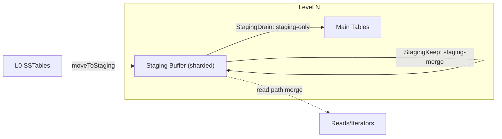

# Staging Buffer Architecture

The staging buffer is a per-level staging area for SSTables—typically promoted from L0—designed to **absorb bursts, reduce overlap, and unlock parallel compaction** without touching the main level tables immediately. It combines fixed sharding, adaptive scheduling, and optional `StagingKeep` (staging-merge) passes to keep write amplification and contention low.

## Design Highlights
- **Sharded by key prefix**: staging tables are routed into fixed shards (top bits of the first byte). Sharding cuts cross-range overlap and enables safe parallel drain.
- **Snapshot-friendly reads**: staging tables are read under the level `RLock`, and iterators hold table refs so mmap-backed data stays valid without additional snapshots.
- **Two staging paths**:
  - *Staging-only compaction*: drain staging → main level (or next level) with optional multi-shard parallelism guarded by `State`.
  - *Staging-merge*: compact staging tables back into staging (stay in-place) to drop superseded versions before promoting, reducing downstream write amplification.
- **StagingMode enum**: plans carry an `StagingMode` with `StagingNone`, `StagingDrain`, and `StagingKeep`. `StagingDrain` corresponds to staging-only (drain into main tables), while `StagingKeep` corresponds to staging-merge (compact within staging).
- **Adaptive scheduling**:
  - Shard selection is driven by `PickShardOrder` / `PickShardByBacklog` using per-shard size, age, and density.
  - Shard parallelism scales with backlog score (based on shard size/target file size) bounded by `StagingShardParallelism`.
  - Batch size scales with shard backlog to drain faster under pressure.
  - Staging-merge triggers when backlog score exceeds `StagingBacklogMergeScore` (default 2.0), with dynamic lowering under extreme backlog/age.
- **Observability**: expvar/stats expose `StagingDrain` vs `StagingKeep` counts, duration, and tables processed, plus staging size/value density per level/shard.

## Configuration
- `StagingShardParallelism`: max shards to compact in parallel (default `max(NumCompactors/2, 2)`, auto-scaled by backlog).
- `StagingCompactBatchSize`: base batch size per staging compaction (auto-boosted by shard backlog).
- `StagingBacklogMergeScore`: backlog score threshold to trigger `StagingKeep`/staging-merge (default 2.0).

## Benefits
- **Lower write amplification**: bursty L0 SSTables land in staging first; `StagingKeep`/staging-merge prunes duplicates before full compaction.
- **Reduced contention**: sharding + `State` allow parallel staging drain with minimal overlap.
- **Predictable reads**: staging is part of the read snapshot, so moving tables in/out does not change read semantics.
- **Tunable and observable**: knobs for parallelism and merge aggressiveness, with per-path metrics to guide tuning.

## Future Work
- Deeper adaptive policies (IO/latency-aware), richer shard-level metrics, and more exhaustive parallel/restart testing under fault injection.
